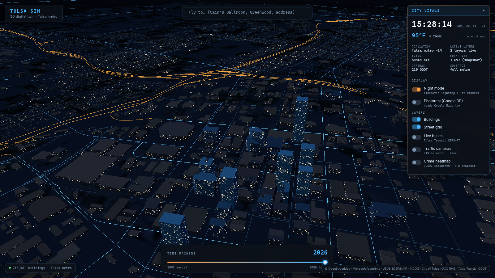
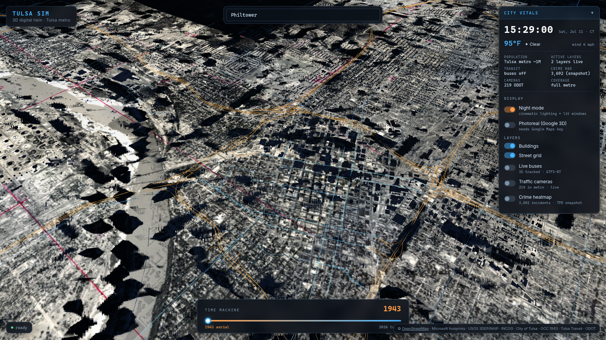

# Tulsa Sim — 3D Digital Twin

Interactive 3D digital twin of Tulsa, Oklahoma, inspired by [nycsim.com](https://nycsim.com). A full-metro procedural city built from real geospatial data: **215,000+ buildings with real heights** streamed as binary tiles, USGS 3DEP terrain with aerial imagery drape, INCOG assessor parcel intelligence, live Tulsa Transit buses, ODOT traffic cameras, an aggregated crime heatmap, a City Vitals dashboard, and a historical time scrubber back to the 1943 aerial survey.





## Quick start

```bash
npm install
npm run dev
```

Open http://localhost:5173. No API keys required — all core data sources are public. (The optional Photoreal mode takes a Google Maps Platform key at runtime; nothing is committed.)

## Features

### City model (Phase 3 fidelity)

- **Full metro, real heights** — every building in the metro bbox (`36.02,-96.15 → 36.25,-95.75`). Footprints are a hybrid: **OSM ways** (72.9k, architectural outlines, best downtown) merged with **Microsoft ML Building Footprints** (145k gap-fill where OSM has no coverage). Heights come from OSM `height`/`building:levels` tags where surveyed (2.2k), Microsoft's ML height estimates transferred onto untagged OSM footprints (50.8k), and seeded residential defaults for the rest.
- **Binary tile streaming with LOD** — buildings bake to 259 compact binary tiles (2 km grid, decimeter-quantized rings, ~8 MB total). At runtime tiles stream around the camera: full extrusions + facade shader within 2.6 km, mid detail to 7 km, large-footprint-only to 19 km. Streets stream the same way with an always-on major-roads overlay.
- **Terrain + imagery** — ground is a displaced heightfield from the **USGS 3DEP** DEM (the Arkansas River valley, Turkey Mountain, and the Osage hills are real relief), draped with **USGS ImageryOnly** aerial photography (metro sheet + 12 km downtown inset). Buildings, streets, buses, cameras, crime cells, and parcel highlights all sit on the terrain.
- **Procedural facades** — a custom shader injects a world-scale window grid into every near-LOD wall: dark glass by day, seeded lit panes by night (picked up by bloom). Small residential footprints get hip-style roofs; land-use codes from OSM polygons tint walls (residential warm, commercial steel-blue, industrial gray).
- **Photoreal mode (optional)** — toggle streams **Google Photorealistic 3D Tiles** (true photogrammetry) re-based from ECEF into the local scene frame, with data overlays still live on top. Requires a Google Maps Platform key entered in the panel (stored in localStorage only; key-gated toggle otherwise).

### Live layers & intelligence

- **City Vitals dashboard** — live Tulsa clock, Open-Meteo weather, population, active-layer count, transit/crime/camera summaries, and all toggles in one glass panel.
- **Live Tulsa Transit buses** — GTFS-Realtime vehicle positions polled every 15 s, decoded with a hand-rolled minimal protobuf reader (`src/data/gtfsrt.ts`). Instanced buses colored by route, heading arrows, glow beacons, stale-feed indicator.
- **Traffic cameras** — ~219 ODOT/OKtraffic cameras in the metro; click a marker for details + a deep link to the live view on OKtraffic.org.
- **Parcel intelligence** — click any building or ground point for a live INCOG assessor spatial join: owner, fair cash value, taxable value, land/improvement split, year built, last sale.
- **Crime heatmap** — warm heat surface aggregated to ~160 m block cells with category filter. No individual incident pins.
- **Time machine** — scrub to 1943: modern buildings fade to ghosts and the 1943 B&W aerial survey drapes over the real terrain.
- **Night/day modes** — moonlit night with lit windows and restrained bloom (fps guard drops bloom first), or afternoon-sun day mode over aerial imagery.
- **Navigation** — orbit/zoom/pan, landmark search with Nominatim fallback, 3-second skippable intro fly-through.

## Data sources & attribution

| Layer | Source | Attribution |
|-------|--------|-------------|
| Building footprints (primary) | [OSM via Overpass](https://overpass-api.de), metro-wide | © [OpenStreetMap](https://www.openstreetmap.org/copyright) contributors, ODbL |
| Building footprints (gap fill) + ML heights | [Microsoft Global ML Building Footprints](https://github.com/microsoft/GlobalMLBuildingFootprints) | © Microsoft, ODbL |
| Terrain | [USGS 3DEP Elevation ImageServer](https://elevation.nationalmap.gov/arcgis/rest/services/3DEPElevation/ImageServer) | USGS, public domain |
| Aerial imagery | [USGS ImageryOnly basemap](https://basemap.nationalmap.gov/arcgis/rest/services/USGSImageryOnly/MapServer) (NAIP composite) | USGS / USDA, public domain |
| Land use | OSM `landuse`/`leisure`/`natural` polygons | © OpenStreetMap contributors, ODbL |
| Parcels / assessor | [INCOG Parcels_TulsaCo FeatureServer](https://map11.incog.org/arcgis11wa/rest/services/Parcels_TulsaCo/FeatureServer/0) (live queries) | INCOG / Tulsa County Assessor |
| Crime | Live: CFS FeatureServer from spec; fallback: bundled TPD snapshot (2016–2019) | City of Tulsa / TPD |
| 1943 aerial | [INCOG Aerial_1943BW ImageServer](https://map11.incog.org/arcgis11wa/rest/services/Aerial_1943BW/ImageServer) | Oklahoma Corporation Commission, via INCOG |
| Live bus positions | [Tulsa Transit GTFS-RT](https://tulsa.rideralerts.com/InfoPoint/GTFS-Realtime.ashx?Type=VehiclePosition) + GTFS static | MetroLink Tulsa |
| Traffic cameras | [OKtraffic](https://oktraffic.org) `api/MapCameras` (snapshot + dev proxy) | Oklahoma DOT |
| Weather | [Open-Meteo](https://open-meteo.com/) | Open-Meteo.com |
| Photoreal mode (optional) | [Google Photorealistic 3D Tiles](https://developers.google.com/maps/documentation/tile/3d-tiles) via `3d-tiles-renderer` | © Google; requires user-supplied API key |

## Known limitations

- **Heights**: Microsoft ML heights are estimates from imagery (they tend to underestimate towers) — surveyed OSM tags win where present; ~45% of small buildings still use seeded 3.5–8 m defaults. True lidar refinement (USGS 3DEP point clouds) is the next step; the bake pipeline (`scripts/bake-metro.mjs`) is structured to slot per-footprint DSM sampling in.
- **Terrain resolution**: the baked heightfield is ~50 m/px — good for valleys and hills, too coarse for curbs/embankments. Buildings sink a 1.5 m foundation to hide slope steps.
- **Imagery**: the downtown inset is ~3 m/px and the metro sheet ~9 m/px; street-level closeups blur. Photoreal mode covers that when a key is provided.
- **Photoreal mode**: implemented against the standard `3d-tiles-renderer` + `GoogleCloudAuthPlugin` flow but not visually verified in CI (no API key available in the build environment); ECEF→ENU alignment math is standard and documented in `src/layers/photoreal.ts`.
- **Crime data**: calls-for-service / RMS extracts are *not* full police reports. The spec's CFS endpoint currently serves no Tulsa-geocoded records, so a bundled 2016–2019 TPD snapshot is labeled and used as fallback.
- **Camera stills**: OKtraffic streams are session-negotiated; camera cards deep-link to the official map instead of embedding frames. The camera list API sends no CORS headers (dev proxy / baked snapshot).
- **Bus service hours**: outside service hours the GTFS-RT feed legitimately reports few or no vehicles.
- **1943 aerial**: bird's-eye, ~20 in resolution, draped over the 12 km downtown inset.
- **Performance**: ~215k buildings stream with distance LOD; the headless CI renderer (SwiftShader, software rasterization) is not representative of real GPUs. The fps guard drops bloom before reducing building density.

## Verification

```bash
npm run dev               # in one terminal
node scripts/verify.mjs   # headless Phase 1+2+3 checklist + 9 screenshots
```

## Data baking

```bash
node scripts/bake-metro.mjs            # terrain + streets + buildings (full metro, binary tiles)
node scripts/bake-metro.mjs buildings  # MS ML + OSM hybrid → public/data/tiles/b_*.bin
node scripts/bake-metro.mjs streets    # OSM highways → s_*.bin + streets-major.bin
node scripts/bake-metro.mjs terrain    # USGS 3DEP DEM → terrain.bin
node scripts/bake-data.mjs transit     # GTFS static routes → transit-routes.json
node scripts/bake-data.mjs cameras     # OKtraffic snapshot → cameras.json
```

Downloads are cached in `.bake-cache/` (gitignored). Committed output is ~9 MB of quantized binary tiles.

## Phase 4 hooks (stubs in `src/layers/phase2-stubs.ts`, `src/ui/concierge.ts`)

Lidar-refined heights (USGS 3DEP EPT) · 1921 Greenwood reconstruction (NYT open GeoJSON) · Sanborn footprints for pre-aerial eras · LLM city concierge.

## License notes

Code: MIT. OSM extracts under [ODbL](https://opendatacommons.org/licenses/odbl/); Microsoft ML footprints under ODbL. USGS elevation/imagery are public domain. Assessor, crime, aerial, transit, and camera data remain subject to their providers' terms (INCOG, City of Tulsa, OCC, MetroLink Tulsa, ODOT). Google 3D Tiles usage is governed by Google Maps Platform terms (user-supplied key).
